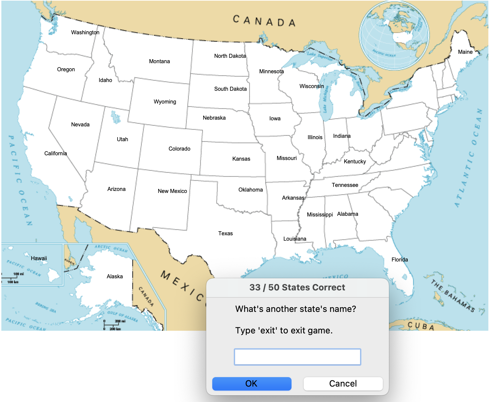

# U.S. States Quiz 

  ## Description

  This is an educational game built with Python where the player enters as many U.S. states as he/she can.  As a new state is entered, the state name fills on on the appropriate place on the USA map.  The player will name as many states as they can until they get to 50.  If the player exits before entering all states, the missing states will be written to a .csv file for the player to review.

  Screenshot of game:

  
  
  ## Table of Contents
  
  - [Installation](#installation)
  - [Usage](#usage)
  - [License](#license)
  - [Contributing](#contributing)
  - [Tests](#tests)
  - [Questions](#questions)
  
  ## Installation
  
  run main.py from the terminal
  
  ## Usage
  
  Follow user prompt and enter one state at a time.  Game will end when you type exit or reach the full 50 states.  Any missing states will be written to the "states_to_learn.csv" file, so the player can see what states were missed.

  ## License
This application is covered under the MIT License.
 For more information: https://opensource.org/licenses/MIT
  
  ## Contributing
  N/A
  
  ## Tests
  N/A

  ## Questions
  Contact Info 
  GitHub user name: BillStephens2022 
  Link to GitHub profile: https://github.com/BillStephens2022 
  Email: stephensbill17@gmail.com